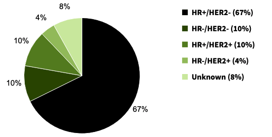
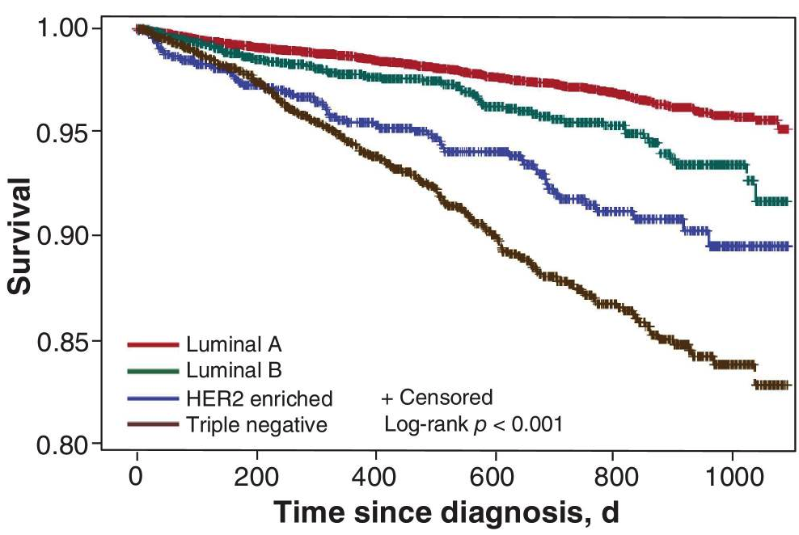
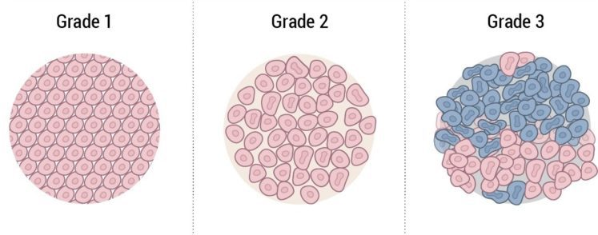
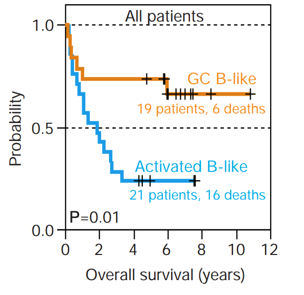
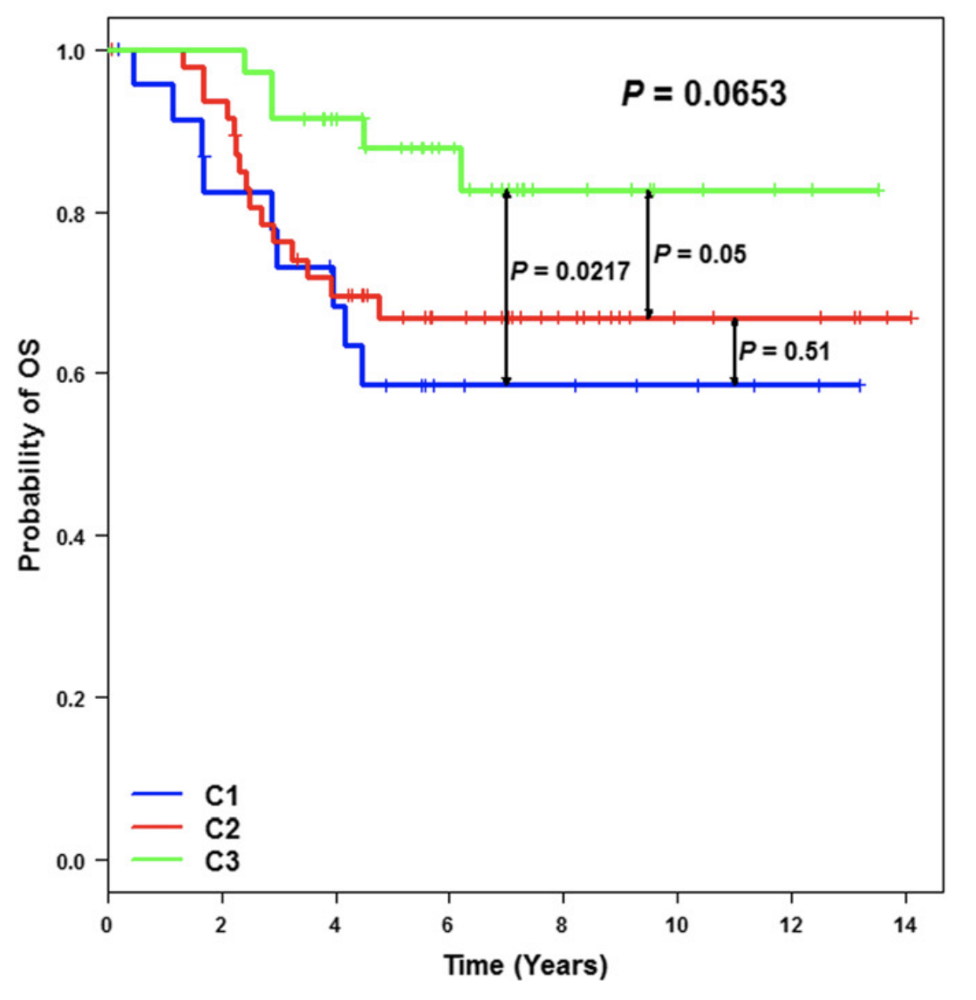
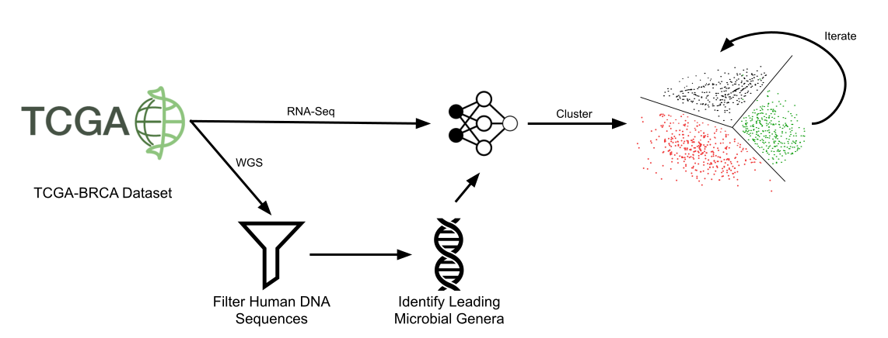

class: middle

# Identifying Novel Breast Cancer Subtypes Using Patterns in the Microbiome

Brian Fogarty  
November 20, 2019  
Northeastern University  
Boston, MA  

---

# Overview

1. Defining cancer subtypes

2. Background
  - Traditional methods of classifying subtypes

  - Gene expression as a tool for subtype classification

  - Immune-associated genes as defining characteristics of subtypes

  - The microbiome and its association with disease

3. Research Question

4. Methods

5. Conclusions

.footer[.author[
Fogarty / 2019
]]

---

class: section-header

# Cancer Subtypes

---

class: split-60

# Cancer is a heterogeneous disease

.cols[
.col-50[
- Cancers are divided into subtypes, which have different clinical behaviors

- Narrowly-focused subtypes provide:
  - more accurate prognoses

  - focused care

  - beter-informed targets for future research

- Breast cancer has four common subtypes: Luminal A, Triple Negative, Luminal B, HER2-enriched
]
.col-50[
.center[
  
  
  .caption[
    <b>Figure 1.</b> Breast cancer cases by subtype, 2012-2016.
  ]
]
]
]

.footer[
.citation[
Figure 1 from "SEER Cancer Statistics Review, 1975-2016," by N. Howlader et al., 2019 (https://seer.cancer.gov/csr/1975_2016/). In the public domain.
]
.author[
Fogarty / 2019
]
]

???
- Luminal A (HR+/HER2-)
- Triple Negative (HR-/HER2-)
- Luminal B (HR+/HER2+)
- HER2-enriched (HR-/HER2+)

---

# Cancer subtypes have different clinical behaviors

.width-40.center[
  
  
  .caption[
    <b>Figure 2.</b> Overall survival of breast cancer patients by subtype. Significantly different clinical outcomes are observed between subtypes.
  ]
]

.footer[
.citation[
Figure 2 from "Breast cancer survival by molecular subtype: a population-based
analysis of cancer registry data," by S. Fallahpour, T.  Navaneelan, P. De, and
A. Borgo, 2017, <i>CMAJ open</i>, <i>5</i>, p.  E734-E739. Copyright 2017,
Joule Inc. or its licensors.
]
.author[
Fogarty / 2019
]
]

---

class: section-header

# Background

---

# Traditional methods of classifying subtypes

- Traditional methods relied on morphological features, such as tumor grade

- Though improved by standardization, early systems suffered from high variablity (Gruver, Portier, & Tubbs, 2011; Longacre et al., 2006; Reis-Filho & Weigelt, 2009)

.width-60.center[
  

  .caption[
    <b>Figure 3.</b> Nottingham histological score. Higher grade is more aggressive.</b>
  ]
]

.footer[
.citation[
Figure 3 adapted from "Staging & Grade - Breast Pathology," by Johns Hopkins University, 2019 (https://pathology.jhu.edu/breast/staging-grade/). Copyright 2019, Johns Hopkins University.
]

.author[
Fogarty / 2019
]
]

???
Tumor grade: how abonormal the tumor appears. Proxy for how aggressive the
tumor will be.

Extra info:

Nottingham is a total of 3 scores, tubule formation (how much it looks like
normal cells), nuclear pleomorphism (how much it looks different from normal
cells), mitotic activity. (how fast cells are dividing) Scored from 1 to 3, so
most abnormal is 9.

---

# Gene expression identifies novel subtypes

.cols[
.col-50[
- The molecular composition of a tumor drives its clinical behavior (Alizadeh et al., 2000; Jézéquel et al., 2015)

- Alizadeh et al. used gene expression to identify novel subtypes of non-Hodgkin's lymphoma (2000)
  - Discovered two molecularly distinct subgroups of diffuse large B-cell lymphoma (DLBCL), the most common subtype

  - 5-year survival rates for the new subgroups were 76% and 16%, compared to 52% for all DLBCL patients
]
.col-50[
.width-60.center[
  

  .caption[
    <b>Figure 4.</b> Overall survival of breast cancer patients by subtype. Significantly different clinical outcomes are observed between subtypes.
  ]
]
]
]

.footer[
.citation[
Figure 4 from "Gene-expression molecular subtyping of triple-negative breast
cancer tumours: importance of immune response" by A. Alizadeh et al., 2000, <i>Nature</i>, <i>403</i>, p. 503-511. Copyright 2000, Springer Nature.
]
.author[
Fogarty / 2019
]
]

???
RNA-seq vs DNA microarray, both used to measure gene expression
RNA-seq newer? Does not limit researcher to known sequences

---

# Gene expression identifies novel subtypes

.cols[
.col-50[
- Clustering of gene expression profiles from 107 triple-negative breast cancer patients identified three novel clusters (Jézéquel et al., 2015)

  - Clusters termed C1, C2, and C3

  - Significantly better survival in cluster C3 compared to both clusters C1 and C2
]
.col-50[
.width-60.center[
  

  .caption[
    <b>Figure 5.</b> Overall survival of triple-negative breast cancer patients clustered by novel subtype.</b>
  ]
]
]
]

.footer[
.citation[
Figure 5 from "Gene-expression molecular subtyping of triple-negative breast
cancer tumours: importance of immune response" by P. Jézéquel et al., 2015,
<i>Breast Cancer Res.</i>, <i>17</i>, p. 43. CC BY.
]
.author[
Fogarty / 2019
]
]

---

# Immune-associated genes often define subtypes

- Immune response a major factor allowing Jézéquel et al. to distinguish novel clusters C2 and C3 (2015)

- High immune response (HIR) a characteristic of the cluster with superior overall survival (Jézéquel et al., 2015)

- High expression of immune proliferation-associated genes corresponds with higher rates of 5-year metastasis-free survival in breast cancer (Schmidt et al., 2008)

- Two breast cancer subtypes, immune benefit-enabled (IBE) and immune benefit-disabled (IBD) identified by gene expression profiling (Miller et al., 2016)
  - IBE tumors can be stratified into prognostic groups based on metastasis-protective immunity

.footer[.author[
Fogarty / 2019
]]

???
Overall survival: length of time a patient is still alive

Progression-free survival: length of time a patient lives with the dieases but does not get worse

Metastasis-free survival: length of time a patient is still alive and the cancer has not metastasized

---

# The microbiome is associated with immune response

- Established links between the microbiome and diseases such as depression, rheumatoid arthritis, and diabetes (Malla et al., 2018)

- Study of the microbiome of melanoma patients reveals a group with increased survival (Chaput et al., 2017)

  - Patients were treated with ipilimumab, an immune checkpoint inhibitor

  - Microbiome genome composition reveals a group with longer progression-free and overall survival

- Study of Anti-PD-1 immunotherapy determined there are differences in the gut microbiome between responders and non-responders (Gopalakrishnan et al., 2018)

- A disfunctioning microbiome may play a role in tumorigenesis (Ren et al., 2019)

.footer[.author[
Fogarty / 2019
]]

---

class: section-header

# Research Question

---

class: center, middle

# Can the composition of the microbiome aid in the identification of novel subtypes of breast cancer?

.footer[.author[
Fogarty / 2019
]]

---

# Establishing a microbiome&mdash;subtype link

.big[
Given that there exist relationships between:
- the immune system and cancer subtypes, and

- the microbiome and the immune system
]

.footer[.author[
Fogarty / 2019
]]

--

.big[We hypothesize that there exists an association between the composition of the microbiome and clinical outcomes of breast cancer, and clustering analysis will reveal novel subtypes based on the microbiome composition.]

---

# Specific Aims

- .big[to determine if the composition of the microbiome can be used to identify clusters of breast cancer cases with significantly differing overall survival]

.footer[.author[
Fogarty / 2019
]]

--

- .big[to identify and characterize novel subtypes of breast cancer from those clusters to serve as candidates for future research]

???

The first aim will achieved if clustering successfully produces clusters

The second aim will be achieved if the newly determined clusters are novel and could be considered new subtypes of breast cancer (rather than just a new clustering of the data)

The first being true does not necessarily mean the second will be true.

---

class: section-header

# Methods

---

# Profiling the microbiome using whole-genome sequencing

- Traditional methods for profiling the microbiome involve 16S rRNA amplicon sequencing

  - Requires fecal or environmental sample

  - Non-specific, does not directly analyze the primary tissue

.footer[.author[
Fogarty / 2019
]]

--

- Profiling the microbiome is possible using whole-genome sequencing (Ren et al., 2019; Zhang et al., 2015)

  - Confounding human DNA filtered before profiling the microbiome

  - Directly studies tissue of interest

---

# Clustering Overview

.center[
  

  .caption[
    <b>Figure 6.</b> Overview of the clustering process.
  ]
]

.footer[.author[
Fogarty / 2019
]]

---

# Methods Overview

- Perform clustering on three datasets:

  - RNA-Seq only

  - recognized molecular subtype only

  - RNA-Seq + microbiome data

- Determine overall survival rate for the clusters

- Compare cluster results to determine if there are novel subtypes with significantly differing survival

.footer[.author[
Fogarty / 2019
]]

---

class: section-header

# Conclusions

---

# Conclusions

.big[
- Cancer is a heterogenous disease, and narrowly-defined subtypes will improve patient care

- Research has established links between cancer subtypes and immune-associated genes

- The microbiome is associated with immune response, including in some cancers

- It may be possible to discover novel cancer subtypes using the microbiome
]

.footer[.author[
Fogarty / 2019
]]

---

# Acknowledgements

.big[
I would like to thank the following individuals for their contributions to this project:

- Dr. Dessy Raytcheva, Northeastern University

- Dr. Hunter Elliott and Dr. Amaro Taylor-Weiner, PathAI

- Dr. Steven Untersee, Northeastern University
]

.footer[.author[
Fogarty / 2019
]]

---

class: section-header

# Questions

---

# Works Cited

.small[
Alizadeh, Ash A., James Hudson, Dennis D. Weisenburger, John C. Byrd, Troy Moore, Jennifer C. Boldrick, Timothy C. Greiner, et al. "Distinct Types of Diffuse Large B-Cell Lymphoma Identified by Gene Expression Profiling." *Nature* 403, no. 6769 (Feb 3, 2000): 503-511. doi:10.1038/35000501. http://dx.doi.org/10.1038/35000501.

Chaput, N., P. Lepage, C. Coutzac, E. Soularue, K. Le Roux, C. Monot, L. Boselli, et al. "Baseline Gut Microbiota Predicts Clinical Response and Colitis in Metastatic Melanoma Patients Treated with Ipilimumab." *Annals of Oncology : Official Journal of the European Society for Medical Oncology* 28, no. 6 (Jun 1, 2017): 1368-1379. doi:10.1093/annonc/mdx108. https://www.ncbi.nlm.nih.gov/pubmed/28368458.

Fallahpour, Saber, Tanya Navaneelan, Prithwish De, and Alessia Borgo. "Breast Cancer Survival by Molecular Subtype: A Population-Based Analysis of Cancer Registry Data." *CMAJ Open* 5, no. 3 (Sep 25, 2017): E734-E739. doi:10.9778/cmajo.20170030. https://www.ncbi.nlm.nih.gov/pubmed/28951445.

Gopalakrishnan, V., C. N. Spencer, L. Nezi, A. Reuben, M. C. Andrews, T. V. Karpinets, P. A. Prieto, et al. "Gut Microbiome Modulates Response to anti–PD-1 Immunotherapy in Melanoma Patients." *Science (New York, N.Y.)* 359, no. 6371 (Jan 5, 2018): 97-103. doi:10.1126/science.aan4236. https://www.ncbi.nlm.nih.gov/pubmed/29097493.

Gruver, Aaron M., Bryce P. Portier, and Raymond R. Tubbs. "Molecular Pathology of Breast Cancer: The Journey from Traditional Practice Toward Embracing the Complexity of a Molecular Classification." *Archives of Pathology & Laboratory Medicine* 135, no. 5 (May, 2011): 544. https://www.ncbi.nlm.nih.gov/pubmed/21526953.

Howlader, N., A. M. Noone, M. Krapcho, D. miller, A. Brest, M. Yu, J. Ruhl, et al. "SEER Cancer Statistics Review, 1975-2016." . Accessed November 20, 2019. https://seer.cancer.gov/csr/1975_2016/.
]

.footer[.author[
Fogarty / 2019
]]

---

# Works Cited

.small[
Jézéquel, Pascal, Delphine Loussouarn, Catherine Guérin-Charbonnel, Loïc Campion, Antoine Vanier, Wilfried Gouraud, Hamza Lasla, et al. "Gene-Expression Molecular Subtyping of Triple-Negative Breast Cancer Tumours: Importance of Immune Response." *Breast Cancer Research : BCR* 17, no. 1 (Mar 20, 2015): 43. doi:10.1186/s13058-015-0550-y. https://www.ncbi.nlm.nih.gov/pubmed/25887482.

Johns Hopkins University. "Staging &amp; Grade - Breast Pathology." . Accessed November 20, 2019. https://pathology.jhu.edu/breast/staging-grade/.

Longacre, Teri A., Marguerite Ennis, Louise A. Quenneville, Anita L. Bane, Ira J. Bleiweiss, Beverley A. Carter, Edison Catelano, et al. "Interobserver Agreement and Reproducibility in Classification of Invasive Breast Carcinoma: An NCI Breast Cancer Family Registry Study." *Modern Pathology : An Official Journal of the United States and Canadian Academy of Pathology, Inc* 19, no. 2 (Feb, 2006): 195-207. doi:10.1038/modpathol.3800496. https://www.ncbi.nlm.nih.gov/pubmed/16341153.

Malla, Muneer Ahmad, Anamika Dubey, Ashwani Kumar, Shweta Yadav, Abeer Hashem, and Elsayed Fathi Abd Allah. "Exploring the Human Microbiome: The Potential Future Role of Next-Generation Sequencing in Disease Diagnosis and Treatment." *Frontiers in Immunology* 9, (2018): 2868. doi:10.3389/fimmu.2018.02868. https://www.ncbi.nlm.nih.gov/pubmed/30666248.

Miller, Lance D., Jeff A. Chou, Michael A. Black, Cristin Print, Julia Chifman, Angela Alistar, Thomas Putti, et al. "Immunogenic Subtypes of Breast Cancer Delineated by Gene Classifiers of Immune Responsiveness." *Cancer Immunology Research* 4, no. 7 (Jul, 2016): 600-610. doi:10.1158/2326-6066.CIR-15-0149. https://www.ncbi.nlm.nih.gov/pubmed/27197066.

Reis-Filho, Jorge S. and Britta Weigelt. "Histological and Molecular Types of Breast Cancer: Is there a Unifying Taxonomy?" *Nature Reviews Clinical Oncology* 6, no. 12 (Dec, 2009): 718-730. doi:10.1038/nrclinonc.2009.166. http://dx.doi.org/10.1038/nrclinonc.2009.166.
]

.footer[.author[
Fogarty / 2019
]]

---

# Works Cited

.small[
Ren, Yijiu, Hang Su, Yunlang She, Chenyang Dai, Dong Xie, Shavira Narrandes, Shujung Huang, Chang Chen, and Wayne Xu. "Whole Genome Sequencing Revealed Microbiome in Lung Adenocarcinomas Presented as Ground-Glass Nodules." *Translational Lung Cancer Research* 8, no. 3 (Jun, 2019): 235-246. doi:10.21037/tlcr.2019.06.11. https://www.ncbi.nlm.nih.gov/pubmed/31367537.

Schmidt, Marcus, Daniel Bohm, Christian von Torne, Eric Steiner, Alexander Puhl, Henryk Pilch, Hans-Anton Lehr, Jan G. Hengstler, Heinz Kolbl, and Mathias Gehrmann. "The Humoral Immune System has a Key Prognostic Impact in Node-Negative Breast Cancer." *Cancer Research* 68, no. 13 (Jul 1, 2008): 5405-5413. doi:10.1158/0008-5472.CAN-07-5206. http://cancerres.aacrjournals.org/cgi/content/abstract/68/13/5405.

Zhang, Chao, Kyle Cleveland, Felice Schnoll-Sussman, Bridget McClure, Michelle Bigg, Prashant Thakkar, Nikolaus Schultz, Manish A. Shah, and Doron Betel. "Identification of Low Abundance Microbiome in Clinical Samples using Whole Genome Sequencing." *Genome Biology* 16, no. 1 (Nov 27, 2015): 265. doi:10.1186/s13059-015-0821-z. https://www.ncbi.nlm.nih.gov/pubmed/26614063.
]

.footer[.author[
Fogarty / 2019
]]
